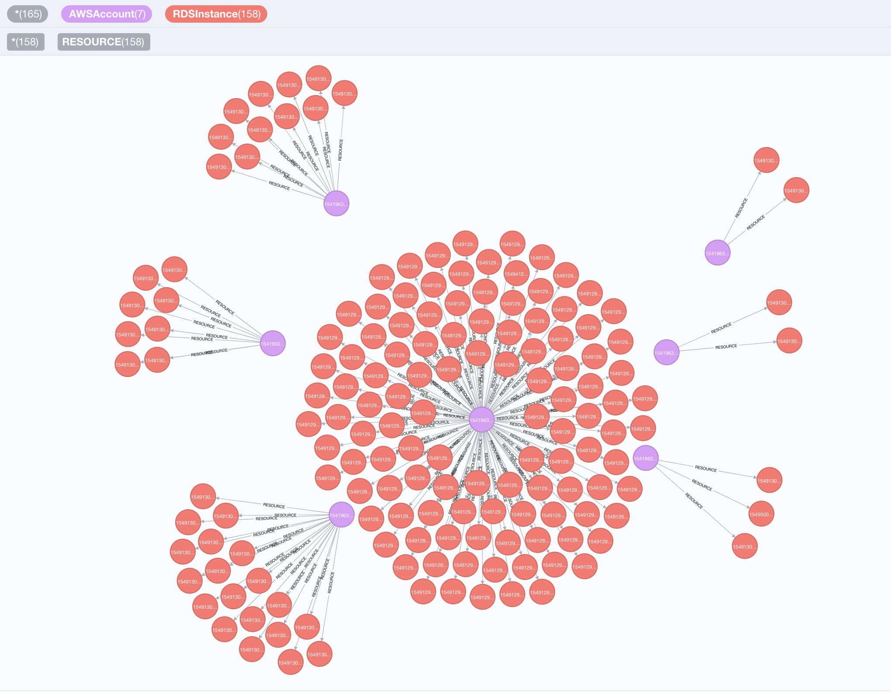

Cartography is a Python tool that consolidates infrastructure assets and the relationships between them in an intuitive graph view powered by a [Neo4j](https://www.neo4j.com) database.



## Why Cartography?
Cartography aims to enable a broad set of exploration and automation scenarios.  It is particularly good at exposing otherwise hidden dependency relationships between your service's assets so that you may validate assumptions about security risks.

Service owners can generate asset reports, Red Teamers can discover attack paths, and Blue Teamers can identify areas for security improvement.   All can benefit from using the graph for manual exploration through a web frontend interface, or in an automated fashion by calling the APIs.

<<<<<<< HEAD
Cartography is not the only [security](https://github.com/dowjones/hammer) [graph](https://github.com/BloodHoundAD/BloodHound) [tool](https://github.com/Netflix/security_monkey) [out](https://github.com/vysecurity/ANGRYPUPPY) [there](https://github.com/duo-labs/cloudmapper), but it differentiates itself by being fully-featured yet generic and [extensible](docs/writing-analysis-jobs.md) enough to help make anyone better understand their risk exposure, regardless of what platforms they use.  Rather than being focused on one core scenario or attack vector like the other linked tools, Cartography focuses on flexibility and exploration.

You can learn more about the story behind Cartography in our [presentation at BSidesSF 2018](https://www.youtube.com/watch?v=8TV9TSNh7pA).


## Installation

Time to set up the server that will run Cartography.  Cartography _should_ work on both Linux and Windows servers, but bear in mind we've only tested it in Linux so far.

1. **Get and install the Neo4j graph database** on your server.

	1. Go to the [Neo4j download page](https://neo4j.com/download-center/#releases), click "Community Server" and download Neo4j Community Edition 3.3.9.

			⚠️ At this time we only support version 3.3.*. ⚠️
			
	2. [Install](https://neo4j.com/docs/operations-manual/current/installation/) Neo4j on the server you will run Cartography on.


2. **Prepare your AWS account(s)** 

	- **If you only have a single AWS account**
		
		1. Set up an AWS identity (user, group, or role) for Cartography to use.  Ensure that this identity has the built-in AWS [SecurityAudit policy](https://docs.aws.amazon.com/IAM/latest/UserGuide/access_policies_job-functions.html#jf_security-auditor) (arn:aws:iam::aws:policy/SecurityAudit) attached.  This policy grants access to read security config metadata.
		2. Set up AWS credentials to this identity on your server, using a `config` and 	`credential` file.  For details, see AWS' [official guide](https://docs.aws.amazon.com/cli/latest/userguide/cli-configure-files.html).
  
 	- **If you want to pull from multiple AWS accounts**, see [here](#multiple-aws-account-setup). 

	
5. **Get and run Cartography** 

	1. Run `pip install cartography` to install our code.

	2. Finally, to sync your data:

		- If you have one AWS account, run

			```
			cartography --neo4j-uri <uri for your neo4j instance; usually bolt://localhost:7687>
			```
		
		- If you have more than one AWS account, run

			```
			AWS_CONFIG_FILE=/path/to/your/aws/config cartography --neo4j-uri <uri for your neo4j instance; usually bolt://localhost:7687> --aws-sync-all-profiles
			```
		
		The sync will pull data from your AWS accounts and ingest data to Neo4j!  This process might take a long time if your account has a lot of assets.


## Usage Tutorial

Once everything has been installed and synced, you can view the Neo4j web interface at http://localhost:7474.  You can view the reference on this [here](https://neo4j.com/developer/guide-neo4j-browser/#_installing_and_starting_neo4j_browser).

### ℹ️ Already know [how to query Neo4j](https://neo4j.com/developer/cypher-query-language/)?  You can skip to our reference material!
If you already know Neo4j and just need to know what are the nodes, attributes, and graph relationships for our representation of infrastructure assets, you can skip this handholdy walkthrough and see our [quick canned queries](#sample-queries).  You can also view our [reference material](#reference). 


### What [RDS](https://aws.amazon.com/rds/) instances are installed in my [AWS](https://aws.amazon.com/) accounts?
```
MATCH (aws:AWSAccount)-[r:RESOURCE]->(rds:RDSInstance) 
return *
```


In this query we asked Neo4j to find all `[:RESOURCE]` relationships from AWSAccounts to RDSInstances, and return the nodes and the `:RESOURCE` relationships.

We will do more interesting things with this result next.


#### ℹ️ Protip - customizing your view
You can adjust the node colors, sizes, and captions by clicking on the node type at the top of the query.  For example, to change the color of an AWSAccount node, first click the "AWSAccount" icon at the top of the view to select the node type 
 

and then pick options on the menu that shows up at the bottom of the view like this: 


### Which RDS instances have [encryption](https://docs.aws.amazon.com/AmazonRDS/latest/UserGuide/Overview.Encryption.html) turned off?
```
MATCH (a:AWSAccount)-[:RESOURCE]->(rds:RDSInstance{storage_encrypted:false}) 
RETURN a.name, rds.id
```


The results show up in a table because we specified attributes like `a.name` and `rds.id` in our return statement (as opposed to having it `return *`).  We used the "{}" notation to have the query only return RDSInstances where `storage_encrypted` is set to `False`.

If you want to go back to viewing the graph and not a table, simply make sure you don't have any attributes in your return statement -- use `return *` to return all nodes decorated with a variable label in your `MATCH` statement, or just return the specific nodes and relationships that you want.

Let's look at some other AWS assets now.


### Which [EC2](https://aws.amazon.com/ec2/) instances are directly exposed to the internet? 
```
MATCH (instance:EC2Instance{exposed_internet: true}) 
RETURN instance.instanceid, instance.publicdnsname 
```

=======
Cartography is not the only [security](https://github.com/dowjones/hammer) [graph](https://github.com/BloodHoundAD/BloodHound) [tool](https://github.com/Netflix/security_monkey) [out](https://github.com/vysecurity/ANGRYPUPPY) [there](https://github.com/duo-labs/cloudmapper), but it differentiates itself by being fully-featured yet generic and [extensible](https://lyft.github.io/cartography/dev/writing-analysis-jobs.html) enough to help make anyone better understand their risk exposure, regardless of what platforms they use.  Rather than being focused on one core scenario or attack vector like the other linked tools, Cartography focuses on flexibility and exploration.
>>>>>>> a3330bed20ae5391fff7799244d37733f61ce15a

You can learn more about the story behind Cartography in our [presentation at BSidesSF 2019](https://www.youtube.com/watch?v=ZukUmZSKSek).

## Install and configure
Start [here](https://lyft.github.io/cartography/install.html).

## Supported platforms
- [Amazon Web Services](https://lyft.github.io/cartography/modules/aws/index.html) -  API Gateway, Config, EC2, ECS, ECR, Elasticsearch, Elastic Kubernetes Service (EKS), DynamoDB, IAM, KMS, Launch Configurations, Launch Templates, Lambda, RDS, Redshift, Route53, S3, Secrets Manager, Security Hub, SQS, STS, Tags
- [Google Cloud Platform](https://lyft.github.io/cartography/modules/gcp/index.html) - Cloud Resource Manager, Compute, DNS, Storage, Google Kubernetes Engine (GKE), IAM, API Gateway, Cloud KMS, Cloudrun, GCP SQL, Firestore, Bigtable, Cloud Function
- [Google GSuite](https://lyft.github.io/cartography/modules/gsuite/index.html) - users, groups
- [Duo CRXcavator](https://lyft.github.io/cartography/modules/crxcavator/index.html) - Chrome extensions, GSuite users
- [Okta](https://lyft.github.io/cartography/modules/okta/index.html) - users, groups, organizations, roles, applications, factors, trusted origins, reply URIs
- [Github](https://lyft.github.io/cartography/modules/github/index.html) - repos, branches, users
- [DigitalOcean](https://lyft.github.io/cartography/modules/digitalocean/index.html)
- [Microsoft Azure](https://lyft.github.io/cartography/modules/azure/index.html) -  CosmosDB, SQL, Storage, Virtual Machine, Function App, Network, Resource Group, Tag, IAM, Key Vaults, AKS
- [Kubernetes](https://lyft.github.io/cartography/modules/kubernetes/index.html) - Cluster, Namespace, Service, Pod, Container
- [PagerDuty](https://lyft.github.io/cartography/modules/pagerduty/index.html) - Users, teams, services, schedules, escalation policies, integrations, vendors


## Usage
Start with our [tutorial](https://lyft.github.io/cartography/usage/tutorial.html). Our [data schema](https://lyft.github.io/cartography/usage/schema.html) is a helpful reference when you get stuck.

## Contact

- Join us on `#cartography` on the [Lyft OSS Slack](https://join.slack.com/t/lyftoss/shared_invite/enQtOTYzODg5OTQwNDE2LTFiYjgwZWM3NTNhMTFkZjc4Y2IxOTI4NTdiNTdhNjQ4M2Q5NTIzMjVjOWI4NmVlNjRiZmU2YzA5NTc3MmFjYTQ).

## Community Meeting

Talk to us and see what we're working on at our [monthly community meeting](https://calendar.google.com/calendar/embed?src=lyft.com_p10o6ceuiieq9sqcn1ef61v1io%40group.calendar.google.com&ctz=America%2FLos_Angeles).
- Meeting minutes are [here](https://docs.google.com/document/d/1VyRKmB0dpX185I15BmNJZpfAJ_Ooobwz0U1WIhjDxvw).
- Recorded videos are posted [here](https://www.youtube.com/playlist?list=PLMga2YJvAGzidUWJB_fnG7EHI4wsDDsE1).
- Our current project road map is [here](https://docs.google.com/document/d/18MOsGI-isFvag1fGk718Aht7wQPueWd4SqOI9KapBa8/edit#heading=h.15nsmgmjaaml).

## Extending Cartography with Analysis Jobs
You can add your own custom attributes and relationships without writing Python code!  Here's [how](docs/writing-analysis-jobs.md).


## Contributing
Thank you for considering contributing to Cartography!

### Code of conduct
Legal stuff: This project is governed by [Lyft's code of conduct](https://github.com/lyft/code-of-conduct).
All contributors and participants agree to abide by its terms.

### Developing Cartography

Get started with our [developer documentation](https://lyft.github.io/cartography/dev/developer-guide.html).

#### Sign the Contributor License Agreement (CLA)

We require a CLA for code contributions, so before we can accept a pull request
we need to have a signed CLA. Please [visit our CLA service](https://oss.lyft.com/cla)
and follow the instructions to sign the CLA.

## Who uses Cartography?

1. [Lyft](https://www.lyft.com)
1. [Thought Machine](https://thoughtmachine.net/)
1. [MessageBird](https://messagebird.com)
1. [Cloudanix](https://www.cloudanix.com/)
1. {Your company here} :-)

If your organization uses Cartography, please file a PR and update this list. Say hi on Slack too!
